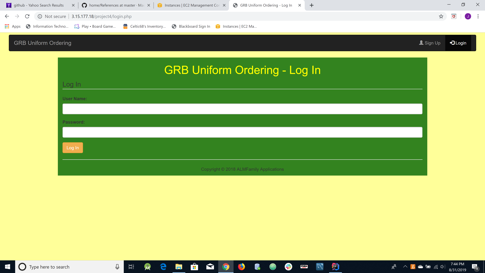

# Joe Alexander Individual Project

This repository will contain the documentation and functionality for ordering uniforms for the GRB Academy. 

### Problem Statement

My son’s travel baseball organization currently uses a manual process for each person to get their uniform. There are 
now over 600 players in the organization that attend the start of the year meeting where there is a table for each part 
of the uniform (pants (including pants style), shirt, shoes, hat, belt and socks) with one staff member manning each 
station. This makes for a lengthy start of year meeting as people are standing in lines waiting for that one staff 
member to assist them.

I would like to build an automated process that allows each family to place their uniform order via a web site. The site will have to have a user interface and an administrative interface. The user interface will allow a user to add / edit players, place an order for the uniform pieces, and view previous orders. Once an order has been placed, an email confirmation will be sent to the user.
The administrative interface will allow the user to add / delete players, view / add / edit uniform orders, and generate reports.

Some initial screen designs:

